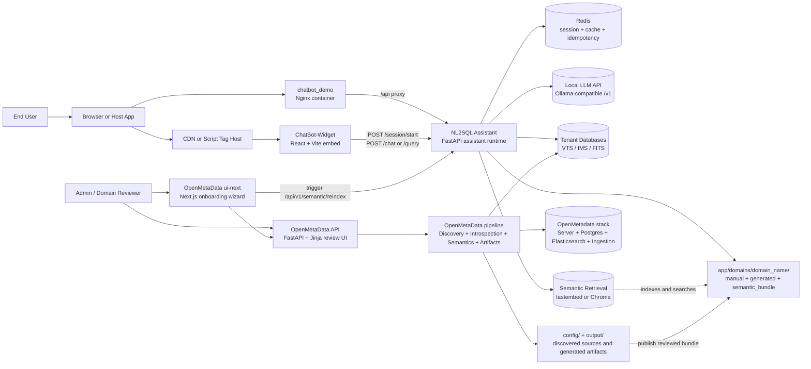
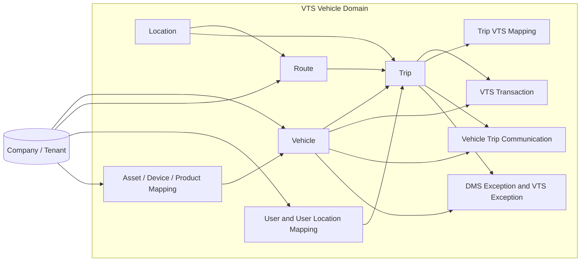
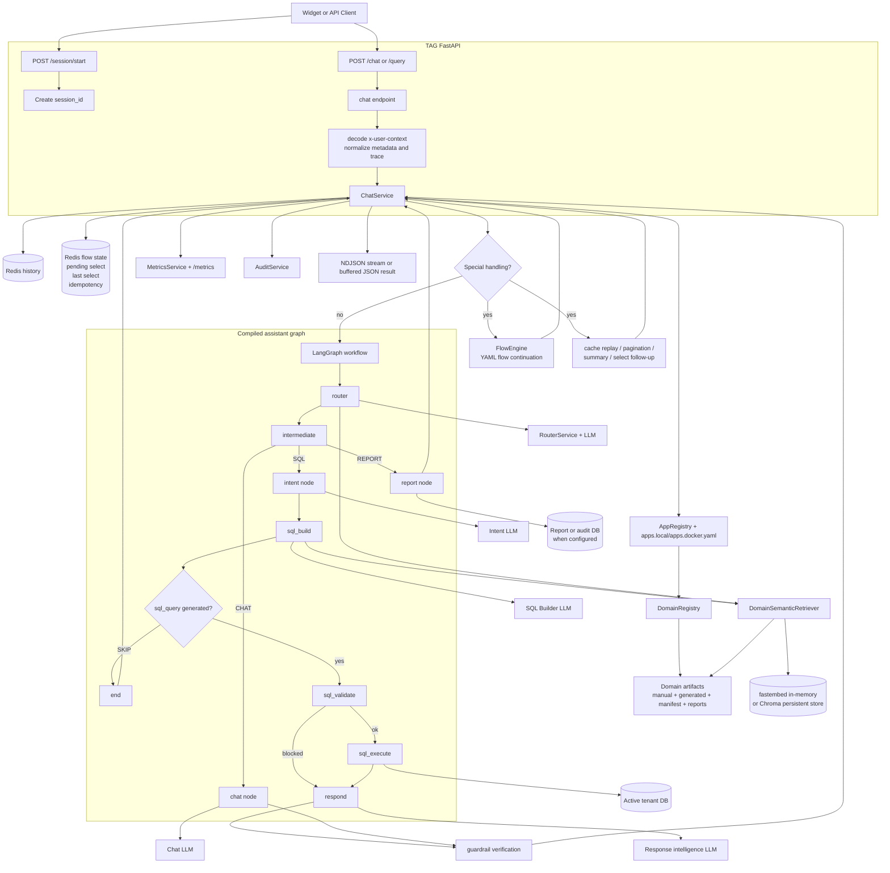
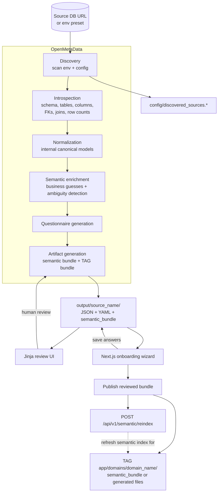
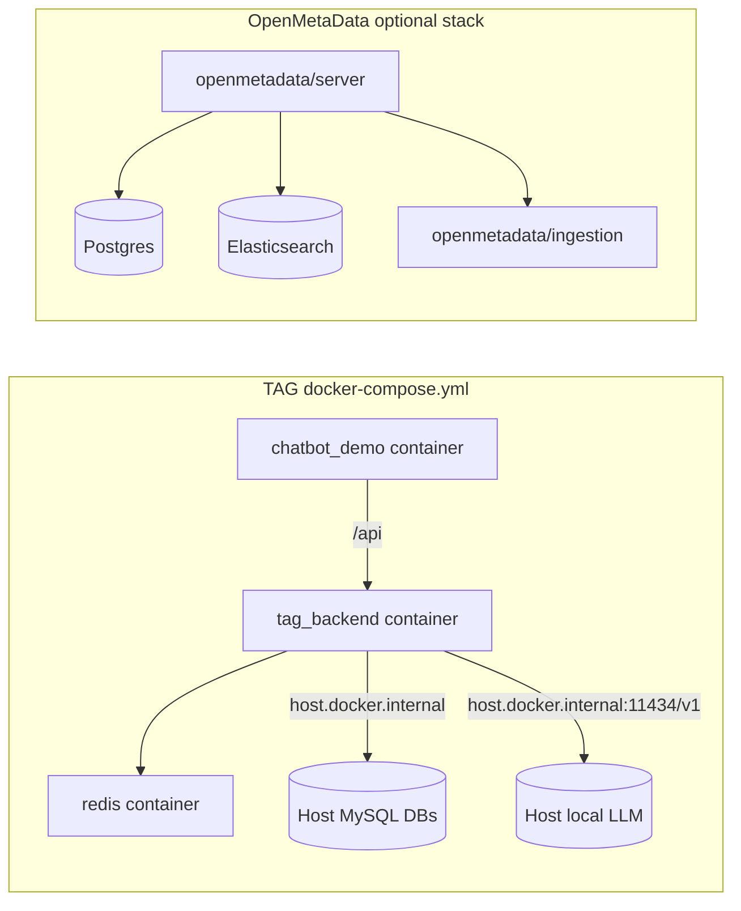

# Workspace Architecture

This document reflects the current workspace as a single platform made of four connected parts:

- `ChatBot-Widget`: embeddable React/Vite chat UI and Docker-served demo shell
- `NL2SQL Assistant`: FastAPI assistant runtime and domain execution engine
- `OpenMetaData`: schema discovery, onboarding, semantic review, and bundle export pipeline
- `config/` and `output/`: shared discovered-source records and generated onboarding artifacts

Current local defaults seen in this workspace:

- default TAG app/domain: `vts` (`Vehicle Tracking System`)
- LLM endpoint: local Ollama-compatible API at `http://127.0.0.1:11434/v1`
- LLM model: `qwen2.5:0.5b`
- semantic retrieval: enabled with `fastembed`
- cache/state store: Redis on `localhost:6384`
- configured tenant DBs: `VTS`, `IMS`, `REMP`

Business-domain note:

- The active TAG runtime defines `vts` as a vehicle tracking and driver management domain.
- Some onboarding output still labels `output/vts/semantic_model.json` as `platform_ops`, but the runtime-facing domain artifacts under `NL2SQL Assistant/app/domains/vts/generated/` are more specific and are the correct source of truth for architecture.

## 1. System Landscape

## 2. VTS Business Domain View

This is the business-facing shape of the active `vts` domain, based on the current runtime artifacts and manifest joins.

Primary runtime interpretation for `vts`:

- core operational record: `trip`
- key business objects: `vehicle`, `trip`, `route`, `location`, `company`, `user`
- tracking/telemetry path: `vehicle` -> `trip` -> `vts_transaction`
- exception path: `trip` and `vehicle` -> `dms_exception` / `vts_exception`
- tenant scoping is heavily driven by `company_id`

## 3. TAG Runtime Request Flow

## 4. Onboarding, Review, and Publish Flow

## 5. Container and Local Dev Topology

## Notes

- The widget can run as an embeddable script bundle or as the `chatbot_demo` Docker service behind Nginx.
- The widget primarily talks to TAG through `POST /session/start` and `POST /chat`; the backend supports both NDJSON streaming and buffered JSON mode.
- TAG routes requests through a LangGraph-based assistant pipeline with `CHAT`, `SQL`, and `REPORT` branches.
- In this workspace, `vts` should be interpreted as a vehicle/fleet tracking domain, not as a generic platform-ops domain.
- Runtime behavior is domain-driven: domain manifests, generated artifacts, manual overrides, reports, flows, glossary, and semantic bundles live under `NL2SQL Assistant/app/domains/<domain_name>/`.
- OpenMetaData is the upstream onboarding pipeline. It discovers database sources, generates semantic artifacts into `output/`, and can publish reviewed bundles back into TAG domain folders.
- Semantic retrieval is enabled in the current `.env` and uses `fastembed` by default, with optional persistent Chroma indexing.
- The OpenMetadata server stack under `OpenMetaData/docker/docker-compose.openmetadata.yml` is optional infrastructure that supports metadata ingestion and search, while the custom FastAPI and Next.js layers handle onboarding and review.
